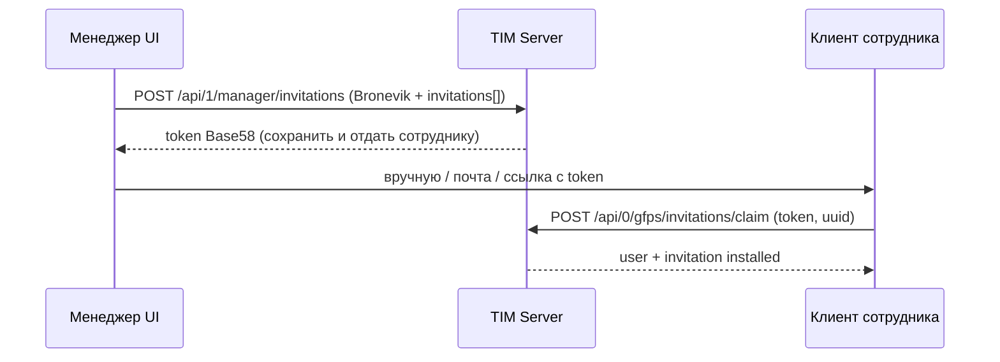

# GFP: флоу приглашения и токена (клиентское приложение)

Документ для реализации в **десктоп/мобильном клиенте** и во **фронте менеджера**. Базовый URL: `https://<host>:<port>` (в проде — только HTTPS).

---

## 1. Роли

| Роль | Аутентификация | Что делает |
|------|----------------|------------|
| **Менеджер / админ** | Bronevik: пары `token` + `u_hash` (как в остальных `/api/1/manager/*`) | Создаёт приглашения, смотрит список (без повторной выдачи секрета) |
| **Сотрудник (установщик)** | Нет Bronevik | Вводит **инвайт-токен** один раз → **claim** → получает учётку `user` в TIM-сервере |

Инвайт-токен (строка Base58) — это **секрет**: не кладите его в логи, аналитику и открытые репозитории.

---

## 2. Формат токена на руках у сотрудника

- Строка в **Base58** (алфавит без `0`, `O`, `I`, `l` — удобно копировать).
- Длина обычно **около 21–23 символов**.
- Криптографически это **16 случайных байт**; на сервере хранится только **SHA-256** от этих байт, восстановить токен из БД нельзя.
- **После создания** токен возвращается **только в ответе API создания**. В ответе **списка** поле `token` у приглашений всегда **`null`** — повторно «достать» ссылку из списка нельзя, нужно сохранить при создании или выдать новое приглашение.

---

## 3. Обязательные требования к HTTP

1. **`Content-Type: application/json`** для тел с JSON.
2. Заголовок **`Host`** должен совпадать с адресом сервера (как у обычного браузера/клиента к этому хосту). Иначе сервер вернёт `400` (`host header is invalid`).
3. В продакшене вызывать API только по **HTTPS**.

Префикс API: **`/api`**.

---

## 4. Менеджер: создать приглашения

**`POST /api/1/manager/invitations`**

Тело JSON:

```json
{
  "token": "<bronevik_token>",
  "u_hash": "<bronevik_u_hash>",
  "team_id": "optional-team-id",
  "invitations": [
    {
      "email": "user@company.com",
      "role_id": "external-role-id-string",
      "firstName": "Иван",
      "lastName": "Иванов",
      "middleName": "Иванович"
    }
  ]
}
```

- Поле **`invitations`** — **непустой массив** → режим **создания**.
- Допустимы также ключи **`first_name` / `last_name` / `middle_name`** вместо camelCase.

**Успех (HTTP 200):**

```json
{
  "status": "success",
  "data": {
    "invitations": [
      {
        "id": 1,
        "token": "BASE58_SECRET_FOR_EMPLOYEE",
        "team_id": "...",
        "email": "...",
        "role_id": "...",
        "firstName": "...",
        "lastName": "...",
        "middleName": "...",
        "installed": false,
        "installed_at": null,
        "user_id": null,
        "created": "2026-01-01T12:00:00+00:00"
      }
    ]
  }
}
```

**Клиент менеджера обязан:**

- Сохранить **`data.invitations[i].token`** для передачи сотруднику (UI, буфер обмена, письмо — по политике продукта).
- Понимать, что **повторно** этот секрет из API не получить (см. список ниже).

**Ошибка авторизации:** `{"status":"error","message":"unauthorized access"}`.

---

## 5. Менеджер: список приглашений

Тот же эндпоинт: **`POST /api/1/manager/invitations`**.

Режим **списка** — если **`invitations` отсутствует**, `null` или **`[]`**:

```json
{
  "token": "<bronevik_token>",
  "u_hash": "<bronevik_u_hash>",
  "team_id": "optional-filter"
}
```

**Успех:** `data.invitations[]` — массив строк **без** секрета: **`token` всегда `null`**.

Используйте для статусов (`installed`, `installed_at`, `email`), а не для повторной выдачи ссылки.

### Статусы строки приглашения

| Статус | Смысл |
|--------|--------|
| `pending` | Ожидает claim по токену |
| `claimed` | Установка выполнена, пользователь привязан |
| `superseded` | Другой инвайт с тем же email уже зарегистрировался; при удалении пользователя менеджером строка может снова стать `pending` |
| `revoked` | Ранее `claimed`, пользователь удалён менеджером; строка для аудита (`revoked_at`) |

Дополнительно в JSON: `superseded_at`, `revoked_at`, вложенный `user` (если есть связь).

---

## 6. Сотрудник: принять приглашение (claim)

**`POST /api/0/gfps/invitations/claim`**  
Bronevik **не** нужен; вызывается с машины, где ставится клиент.

Тело — **только** `token` и `uuid` (поле `username` в claim **не используется** и не должно передаваться):

```json
{
  "token": "BASE58_SECRET_FROM_MANAGER",
  "uuid": "stable-per-device-uuid-v4"
}
```

| Поле | Обязательно | Смысл |
|------|-------------|--------|
| `token` | да | Строка Base58, как выдали при создании |
| `uuid` | да | **Стабильный** идентификатор установки/пользователя на этом устройстве (например один и тот же UUID в `settings` после первого запуска) |

### Поле `username` в модели пользователя

В таблице **`usermodel`** по-прежнему есть колонка **`username`** (совместимость с ActivityWatch). **При claim она не заполняется** — остаётся пустой строкой. Задать или изменить подпись можно позже:

- сотрудник: **`PUT /api/0/user`** с тем же **`uuid`** и полем **`username`** в теле;
- менеджер: **`PUT /api/1/manager/users/<id>`** с Bronevik и **`username`** в теле.

Идентификация пользователя в API — всегда **`uuid`** (и числовой **`id`** в ответах).

**Успех (HTTP 200):**

```json
{
  "status": "success",
  "user": {
    "id": 42,
    "uuid": "...",
    "username": "",
    "firstName": "...",
    "lastName": "...",
    "middleName": "...",
    "email": "...",
    "role_id": "...",
    "team": ["team-id"],
    "client_version": null,
    "created": "...",
    "data": {}
  },
  "invitation": {
    "id": 1,
    "token": null,
    "installed": true,
    "user_id": 42,
    "..."
  }
}
```

Сохраните в клиенте **`user.id`** (числовой id для TIM API) и **`user.uuid`** — они нужны для дальнейших запросов ActivityWatch/GFP (`uuid` в query к heartbeat и т.д., как в вашем текущем клиенте).

### Ошибки claim (HTTP 200 с телом ошибки)

Сервер часто отвечает **200** и JSON с полем **`status": "error"`** (проверяйте тело, не только код).

| Ситуация | Пример тела |
|----------|-------------|
| Неверный токен | `{"status":"error","message":"invitation not found"}` |
| Инвайт уже использован | `{"status":"error","error":"invitation_already_used","invitation":{...}}` |
| `uuid` уже зарегистрирован | `{"status":"error","error":"uuid_already_registered"}` |
| Нет `token` или `uuid` | `400` + `{"status":"error","message":"missing token"}` и т.п. |

**Повторный claim** тем же инвайтом с другого `uuid` → `invitation_already_used` (одна активация на инвайт).

---

## 6.1. Обновление `client_version` (уточнённый контракт)

**Отдельного** эндпоинта под версию **нет**: используется обычный публичный GFP **`PUT /api/0/user`** (тег `gfp` в Swagger), **без** Bronevik и **без** numeric `user_id` менеджера.

| | |
|---|---|
| **Метод и путь** | `PUT /api/0/user` |
| **Тело (JSON)** | Обязателен **`uuid`** — тот же стабильный UUID пользователя, что после claim (и в heartbeat). Для отчёта о версии добавьте **`client_version`**: строка (например `1.4.2` или build id). Остальные поля из модели UserPut опциональны (`username`, `team`, `email`, `role_id`, `firstName` / …, `data`). |
| **Минимальный пример** | `{"uuid": "<uuid>", "client_version": "1.2.3"}` |
| **Ответ** | HTTP `200`, тело `{"status": "ok"}` (как в текущей реализации). |

Альтернатива для **менеджера** (Bronevik): `PUT /api/1/manager/users/<int:user_id>` с `token`, `u_hash` в теле и полем `client_version` — для админки, не для локального клиента сотрудника.

Итого для клиентского приложения сотрудника: **один контракт** — **`PUT /api/0/user`** с `uuid` + `client_version`.

---

## 7. Рекомендуемый порядок действий в клиенте установщика

1. При первом запуске сгенерировать и **навсегда сохранить** `uuid` (файл настроек, Keychain и т.д.).
2. Показать поле ввода **инвайт-токена** (или глубокую ссылку, из которой вы парсите токен).
3. Отправить **`POST .../claim`** с `token` и `uuid` (без `username`; его задают позже через `PUT /api/0/user` при необходимости).
4. При `success` — записать `user`, перейти в основной режим работы.
5. Периодически (например раз в час) вызывать **`PUT /api/0/user`** с телом `{"uuid": "<uuid>", "client_version": "<version>"}` — см. §6.1.

---

## 8. Безопасность и UX

- Не логировать полный токен; при отладке — только префикс/длина.
- Передавать токен только по HTTPS.
- Не хранить токен в облачном бэкапе без шифрования, если не требуется по продукту.

---

## 9. Диаграмма последовательности



---

## 10. Связанные ссылки в репозитории

- API v1 (рус.): [docs/API_V1_RU.md](API_V1_RU.md), краткая отсылка: [v1.md](../v1.md).
- Выкладка на сервер: [docs/DEPLOY.md](DEPLOY.md).
- Swagger UI: `GET /api/` на запущенном сервере.
- Реализация токенов: `aw-core/aw_datastore/invitation_tokens.py`.
- Версия клиента: **`PUT /api/0/user`** + `client_version` (§6.1).
